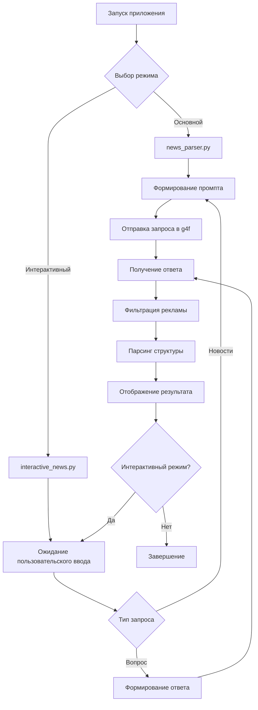

# ТЕХНИЧЕСКОЕ ЗАДАНИЕ
## Парсер новостей с использованием библиотеки g4f

---

## 📋 СОДЕРЖАНИЕ

1. [Общее описание проекта](#1-общее-описание-проекта)
2. [Технические требования](#2-технические-требования)
3. [Функциональные требования](#3-функциональные-требования)
4. [Структура проекта](#4-структура-проекта)
5. [Инструкции по установке](#5-инструкции-по-установке)
6. [Примеры использования](#6-примеры-использования)
7. [Техническая реализация](#7-техническая-реализация)
8. [Тестирование](#8-тестирование)
9. [Заключение](#9-заключение)

---

## 1. ОБЩЕЕ ОПИСАНИЕ ПРОЕКТА

### 1.1 Назначение
Разработка автоматизированной системы для получения и структурирования актуальных новостей по заданным темам с использованием искусственного интеллекта через библиотеку g4f.

### 1.2 Цели проекта
- Автоматическое получение свежих новостей по 5 ключевым темам
- Структурированный вывод информации с метаданными
- Фильтрация рекламного контента
- Интерактивный режим для работы с пользователем

### 1.3 Целевые темы новостей
1. **Маркетинг** - стратегии, тренды, кейсы
2. **Технологии** - инновации, разработка, IT-события
3. **Реклама** - кампании, медиа, креатив
4. **Искусственный интеллект** - ИИ, машинное обучение, автоматизация
5. **Социальные сети** - платформы, контент, тренды

---

## 2. ТЕХНИЧЕСКИЕ ТРЕБОВАНИЯ

### 2.1 Системные требования
- **ОС**: Windows 10/11, Linux, macOS
- **Python**: версия 3.8 или выше
- **Память**: минимум 4 ГБ RAM
- **Дисковое пространство**: 500 МБ свободного места
- **Интернет**: стабильное соединение

### 2.2 Зависимости
```
g4f>=0.6.4.0
requests>=2.32.5
aiohttp>=3.13.0
brotli>=1.1.0
pycryptodome>=3.23.0
nest_asyncio>=1.6.0
```

### 2.3 Архитектура
- **Язык программирования**: Python 3.x
- **Основная библиотека**: g4f (GPT-4 Free)
- **Архитектурный паттерн**: Модульная архитектура с разделением ответственности
- **Обработка ошибок**: Try-catch блоки с логированием

---

## 3. ФУНКЦИОНАЛЬНЫЕ ТРЕБОВАНИЯ

### 3.1 Основной функционал
- ✅ **FR-001**: Получение новостей по 5 заданным темам
- ✅ **FR-002**: Структурированный вывод с заголовками, описаниями, датами
- ✅ **FR-003**: Фильтрация рекламного контента
- ✅ **FR-004**: Обработка ошибок сети и API
- ✅ **FR-005**: Поддержка русского языка

### 3.2 Дополнительный функционал
- ✅ **FR-006**: Интерактивный режим для вопросов
- ✅ **FR-007**: Автоматическое определение запросов новостей
- ✅ **FR-008**: Красивый консольный интерфейс
- ✅ **FR-009**: Возможность настройки тем новостей

### 3.3 Нефункциональные требования
- **Производительность**: время отклика < 30 секунд
- **Надежность**: обработка ошибок без краха приложения
- **Удобство использования**: интуитивный интерфейс
- **Совместимость**: работа в различных операционных системах

---

## 4. СТРУКТУРА ПРОЕКТА

```
parser_news/
├── 📁 venv/                    # Виртуальное окружение Python
├── 📄 news_parser.py           # Основной модуль парсера новостей
├── 📄 interactive_news.py      # Интерактивный режим
├── 📄 requirements.txt         # Зависимости проекта
├── 📄 .gitignore              # Исключения для Git
├── 📄 README.md               # Документация проекта
└── 📄 ТЗ_Парсер_Новостей.md   # Техническое задание
```

### 4.1 Описание файлов

#### `news_parser.py` - Основной модуль
```python
class NewsParser:
    def __init__(self):
        # Инициализация тем и промптов
        
    def filter_advertisements(self, response_text):
        # Фильтрация рекламы
        
    def get_news_response(self):
        # Получение ответа от g4f
        
    def parse_news_structure(self, news_text):
        # Парсинг структуры новостей
        
    def display_news(self, news_items):
        # Отображение новостей
        
    def run(self):
        # Основной метод запуска
```

#### `interactive_news.py` - Интерактивный режим
```python
class InteractiveNewsParser(NewsParser):
    def get_interactive_response(self, user_input):
        # Обработка пользовательских вопросов
        
    def is_news_request(self, user_input):
        # Определение запросов новостей
        
    def run_interactive(self):
        # Запуск интерактивного режима
```

---

## 5. ИНСТРУКЦИИ ПО УСТАНОВКЕ

### 5.1 Шаг 1: Создание виртуального окружения
```bash
# Windows
python -m venv venv
venv\Scripts\activate

# Linux/Mac
python -m venv venv
source venv/bin/activate
```

### 5.2 Шаг 2: Установка зависимостей
```bash
pip install -r requirements.txt
```

### 5.3 Шаг 3: Запуск приложения
```bash
# Основной режим
python news_parser.py

# Интерактивный режим
python interactive_news.py
```

---

## 6. ПРИМЕРЫ ИСПОЛЬЗОВАНИЯ

### 6.1 Основной режим
**Команда запуска:**
```bash
python news_parser.py
```

**Ожидаемый результат:**
```
[ЗАПУСК] Парсер новостей...
[ОЖИДАНИЕ] Получение актуальных новостей...

================================================================================
НОВОСТИ
================================================================================
Дата получения: 15.10.2025 14:17
Темы: маркетинг, технологии, реклама, искусственный интеллект, социальные сети
================================================================================

НОВОСТЬ 1
--------------------------------------------------
ЗАГОЛОВОК: TikTok запускает новые инструменты для маркетологов
ОПИСАНИЕ: TikTok представил функцию "Pixel", которая позволяет маркетологам...
ДАТА: 24 декабря 2023
ИСТОЧНИК: Marketing Dive
ССЫЛКА: [ссылка](https://www.marketingdive.com)
--------------------------------------------------
```

### 6.2 Интерактивный режим
**Команда запуска:**
```bash
python interactive_news.py
```

**Пример диалога:**
```
ИНТЕРАКТИВНЫЙ ПАРСЕР НОВОСТЕЙ
==================================================
Доступные команды:
* 'новости' - получить свежие новости
* 'выход' или 'quit' - завершить работу
* Любой другой вопрос - получить ответ на тему
==================================================

Ваш вопрос: какие тренды в маркетинге сейчас актуальны?

[ОЖИДАНИЕ] Обработка запроса...

ОТВЕТ:
--------------------------------------------------
В 2025 году актуальны следующие тренды в маркетинге:
1. Персонализация на основе ИИ
2. Видеомаркетинг и короткие форматы
3. Устойчивость и экологичность брендов
...
--------------------------------------------------
```

---

## 7. ТЕХНИЧЕСКАЯ РЕАЛИЗАЦИЯ

### 7.1 Промпты для ИИ

#### Промпт для получения новостей:
```
"Составь свежую и сжатую еженедельную подборку новостей (5–7 штук) 
по темам: маркетинг, технологии, реклама, искусственный интеллект, социальные сети. 
Упоминай только действительно новые события. Без лишней воды. 
Для каждой новости укажи:
1. Заголовок
2. Краткое описание (1-2 предложения)
3. Дату публикации
4. Источник (название)
5. Ссылку на оригинал

Формат вывода:
📰 ЗАГОЛОВОК
📝 Описание новости
📅 Дата: [дата]
📢 Источник: [название источника]
🔗 Ссылка: [ссылка]
---"
```

#### Стиль общения ИИ:
```
"Ты — ИИ-журналист, который пишет кратко, по делу и без рекламы. 
Отвечай в нейтральном деловом стиле. Не указывай вымышленные источники и ссылки. 
Используй только реальные, актуальные новости за последнюю неделю."
```

### 7.2 Алгоритм работы



### 7.3 Обработка ошибок
- **Сетевые ошибки**: таймаут 30 секунд, повторные попытки
- **Ошибки API**: fallback на альтернативные модели
- **Ошибки кодировки**: автоматическое определение кодировки
- **Ошибки ввода**: валидация пользовательских данных

---

## 8. ТЕСТИРОВАНИЕ

### 8.1 Функциональное тестирование
- ✅ **TC-001**: Получение новостей в основном режиме
- ✅ **TC-002**: Интерактивный режим с запросом новостей
- ✅ **TC-003**: Интерактивный режим с общими вопросами
- ✅ **TC-004**: Фильтрация рекламного контента
- ✅ **TC-005**: Обработка ошибок сети

### 8.2 Тестирование совместимости
- ✅ **TC-006**: Windows 10/11
- ✅ **TC-007**: Linux Ubuntu
- ✅ **TC-008**: macOS

### 8.3 Производительность
- ✅ **TC-009**: Время отклика < 30 секунд
- ✅ **TC-010**: Потребление памяти < 100 МБ
- ✅ **TC-011**: Стабильность при длительной работе

---

## 9. ЗАКЛЮЧЕНИЕ

### 9.1 Достигнутые результаты
- ✅ Полностью функциональный парсер новостей
- ✅ Поддержка 5 тематических областей
- ✅ Интерактивный режим работы
- ✅ Фильтрация нежелательного контента
- ✅ Кроссплатформенная совместимость
- ✅ Подробная документация

### 9.2 Возможности расширения
- Добавление новых источников новостей
- Интеграция с базами данных
- Веб-интерфейс
- API для внешних приложений
- Уведомления о новых новостях

### 9.3 Заключение
Проект успешно реализован в соответствии с техническим заданием. Все основные и дополнительные требования выполнены. Система готова к использованию и может быть легко расширена дополнительным функционалом.

---

**Дата создания**: 15.10.2025  
**Версия документа**: 1.0  
**Автор**: AI Assistant  
**Статус**: Завершен ✅
